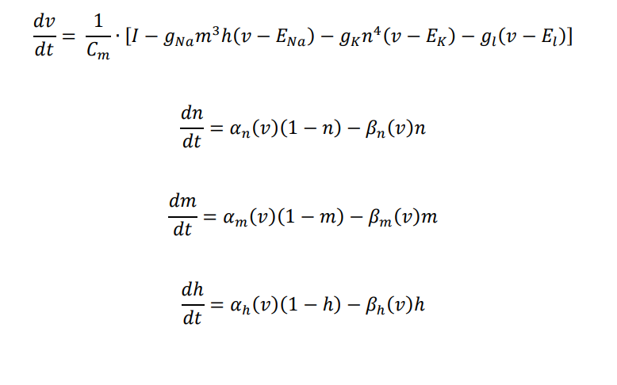
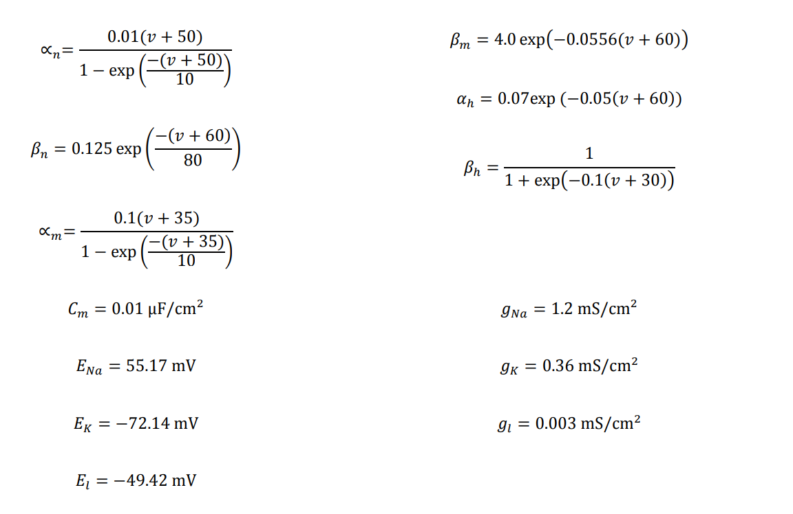
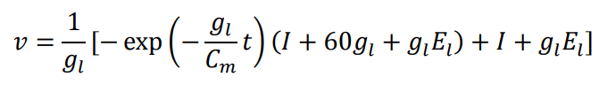
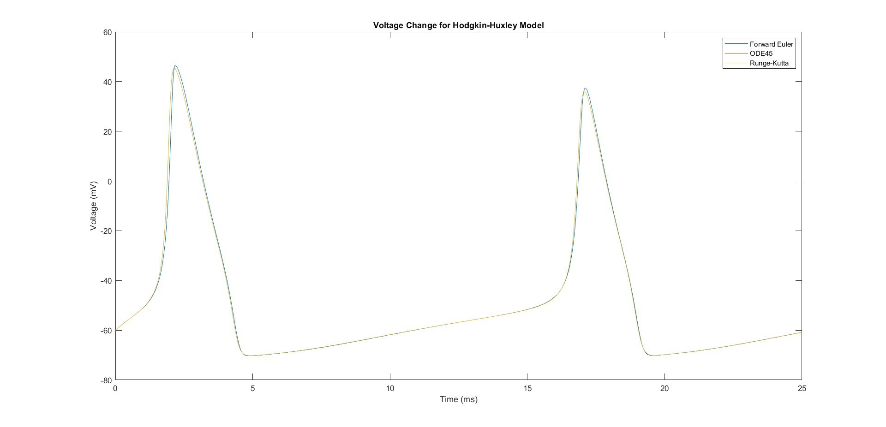
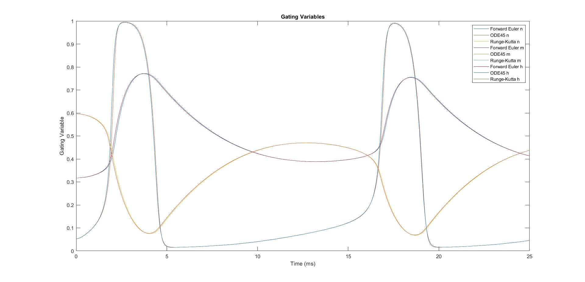
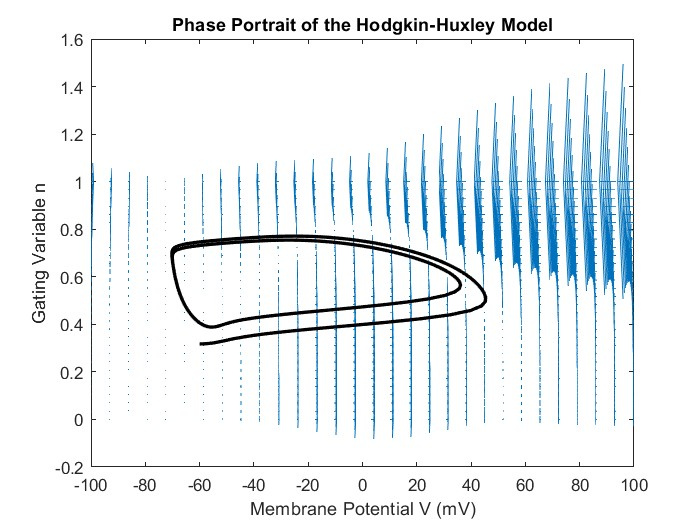
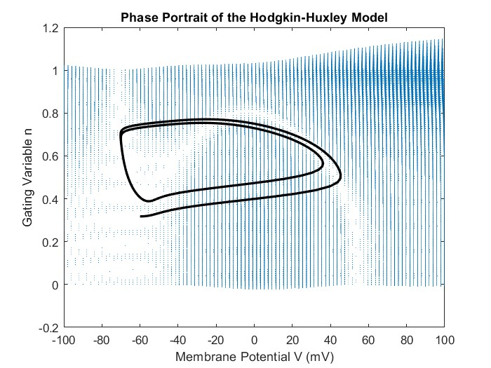
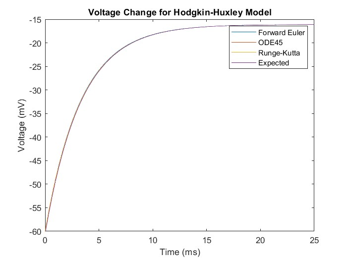

# The Hodgkin-Huxley Model solver
Comparing ODE models for simulating Hodgkin Huxley Model in MATLAB

## Formulas
Based on Hodgkin-Huxley model, certain formulas are given:

<b>Exact solution</b> can be simulated by setting 2 gating variables to 0. We set `gbarNa` and `gbarK` to <b>0</b> for that purpose when running ODE comparison. Exact model can be calculated using this formula: 

## Numerical methods used
- Forward Euler
- Runge-Kutta
- ODE45 

## Run instructions
<b>Run `comparisons.m` or `phase_portrait.m` from root folder</b>.
 
_NOTE:_ Make sure you set the desired flags at the beggining of the file in a section `%% Preprocess`.

If you want to run a <b>specific model</b>, run `add_paths.m` first and then `forward_euler.m`, `ode_45.m`, `runge_kutta.m` or `exact_solution.m` depending on your choice.
 
_NOTE:_ Make sure you set the <b>function arguments</b> when calling a model. First argument is <b>exact solution</b> and second is <b>plot</b> flag.

## Results

### Without exact solution

### With exact solution

| Error     | Euler             | ODE45             | Runge-Kutta       |
| :---:     | :---:             | :---:             | :---:             |
| MAE       | 0.1050938840      | 0.0701103701      | 0.0701102954      |
| MSE       | 0.0301526437      | 0.0184829570      | 0.0184826558      |

_MAE = Mean Absolute Error_
 
_MSE = Mean Square Error_

## Work done by
- Lea Kojičić
- Branko Grbić