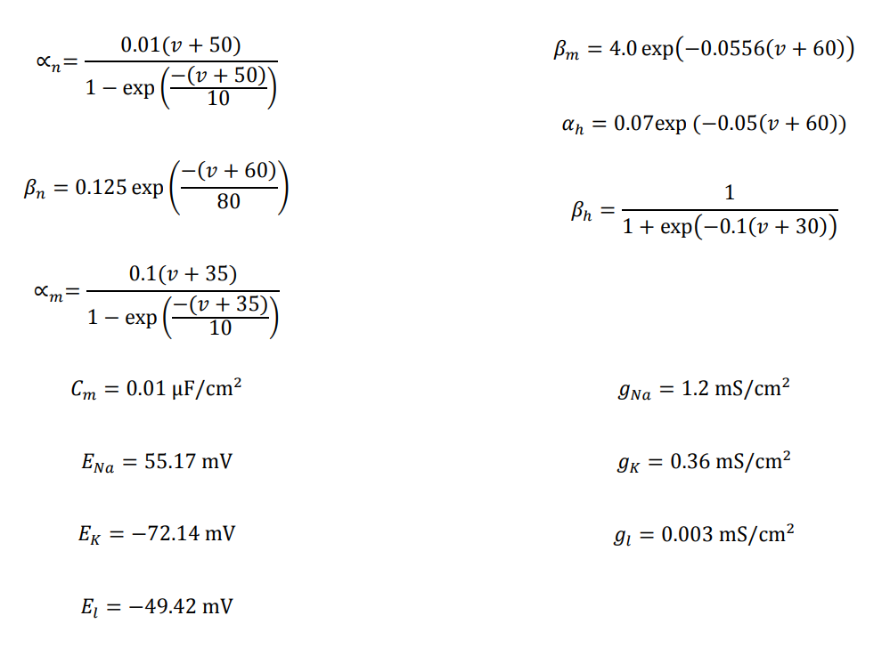

# The Hodgkin Huxley Model solver
Comparing differential equation solvers for simulating Hodgkin Huxley Model in MATLAB

## Formulas
Based on Hodgkin-Huxley model, certain formulas are given:

<b>Exact solution</b> can be simulated trough setting 2 gating variables to 0. We set `gbarNa` and `gbarK` to 0 for that purpose when running ODE comparison.

## Numerical methods used
- Forward Euler
- Runge-Kutta
- ODE45 

## Run instructions
<b>Run `comparisons.m` or `phase_portrait.m` from root folder</b>.
 
_NOTE:_ Make sure you set the desired flags at the beggining of the file in a section `%% Preprocess`.

If you want to run a <b>specific model</b>, run `add_paths.m` first and then `forward_euler.m`, `ode_45.m`, `runge_kutta.m` or `exact_solution.m` depending on your choice.
 
_NOTE:_ Make sure you set the <b>function arguments</b> when calling a model. First argument is <b>exact solution</b> and second is <b>plot</b> flag.

## Results

#### Without exact solution

#### With exact solution

## Work done by
- Lea Kojičić
- Branko Grbić